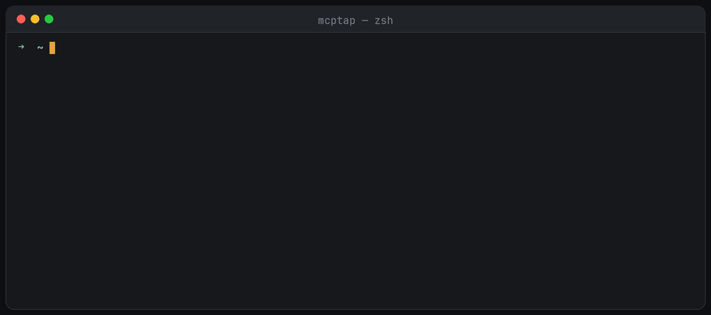

<p align="center">
  
</p>

<p align="center"><strong>See every tool call your AI agents make.</strong></p>

<p align="center">
  <a href="https://www.npmjs.com/package/@wayv-software/mcptap"></a>
  <a href="https://github.com/WayV-Inc/mcptap/actions/workflows/ci.yml"></a>
  
  
</p>

<p align="center">
  
</p>

mcptap is a zero-config audit proxy for [MCP](https://modelcontextprotocol.io) servers.
It sits between your AI client (Claude Code, Claude Desktop, Cursor, …) and any MCP
server, passing traffic through untouched while logging every request, response, and
tool call to local JSONL files — with arguments, results, durations, and errors.

Your agents read files, hit APIs, and run commands on your behalf. Today that traffic
is invisible. mcptap makes it visible.

- **Zero config** — wrap any server command, done
- **Local-first** — logs stay in `~/.mcptap/logs/`, nothing leaves your machine
- **Transparent** — byte-for-byte passthrough; your client and server never know it's there
- **Secret-aware** — values of keys like `token`, `password`, `api_key` are redacted before logging
- **Zero dependencies** — Node stdlib only

## Install

```sh
npm install -g @wayv-software/mcptap
```

The command is still just `mcptap`.

## Use

The fast way — let the wizard find your clients and wrap everything:

```sh
mcptap setup
```

It detects 13 clients — Claude Code (including per-project servers), Claude
Desktop, Codex CLI, Cursor, Windsurf, VS Code, VS Code Insiders, Cline, Roo Code,
Gemini CLI, LM Studio, Zed, and project `.mcp.json` files — shows what it found,
and wraps the servers you select. Every modified config gets a timestamped
backup, and `mcptap setup --undo` reverses it.

No MCP servers yet? `mcptap add` installs ready-to-use ones (filesystem, memory,
sequential-thinking, a demo server) into any client, pre-wrapped so they're logged
from their first call.

For always-on coverage, say yes when setup offers **autopilot** (macOS): a tiny
launchd watcher re-runs the wrap whenever a client config changes, so servers you
add next month get logged too. `mcptap autopilot off` removes it.

The manual way — wrap the server command in your MCP client config. Before:

```json
{ "command": "npx", "args": ["-y", "@modelcontextprotocol/server-filesystem", "/tmp"] }
```

After:

```json
{ "command": "mcptap", "args": ["--", "npx", "-y", "@modelcontextprotocol/server-filesystem", "/tmp"] }
```

Then watch the traffic:

```sh
mcptap watch          # live dashboard — throughput, per-tool activity, alerts
mcptap logs -f        # raw stream, follow live
mcptap stats          # totals, error rates, p95 latency per tool
```

## Tool-change detection

mcptap fingerprints every tool definition the first time it sees it. If a server
later changes a tool's **description** or **input schema**, you get an alert:

```
⚠  tool changes detected   possible rug pull — MCP03
   ● github  ·  create_issue   description-changed
```

This is the rug-pull / tool-poisoning pattern from the OWASP MCP Top 10 (MCP03):
a server serves benign definitions on first contact, then swaps in hidden
instructions later. Tool descriptions land in your model's context as trusted
text, so a silent change is a real attack surface. Reset baselines with
`mcptap trust --reset`.

Example output:

```
14:02:11 server-filesystem → initialize {"protocolVersion":"2025-06-18",…}
14:02:11 server-filesystem ← initialize ok (12ms)
14:02:15 server-filesystem → tools/call {"name":"read_file","arguments":{"path":"/tmp/notes.md"}}
14:02:15 server-filesystem ← tools/call ok (3ms)
14:02:20 server-filesystem → tools/call {"name":"write_file","arguments":{"path":"/etc/passwd",…}}
14:02:20 server-filesystem ← tools/call ERROR (1ms) {"code":-32000,"message":"Access denied"}
```

Raw JSONL lives in `~/.mcptap/logs/<server>-<date>.jsonl` — pipe it into `jq`, ship it
wherever you like.

## Configuration

| Env var | Default | Purpose |
|---|---|---|
| `MCPTAP_NAME` | derived from command | Server name used in logs |
| `MCPTAP_MAX_BYTES` | `4096` | Truncate logged payloads beyond this size |

## Documentation

Full docs live in [`docs/`](docs/README.md): [installation](docs/installation.md),
[getting started](docs/getting-started.md), [CLI reference](docs/cli-reference.md),
[log format](docs/log-format.md), and [FAQ](docs/faq.md).

## Why

OWASP's MCP Top 10 lists *lack of audit and telemetry* (MCP08) as a core risk of
agentic systems. Enterprise gateways solve it for companies; nothing lightweight
existed for the individual developer. mcptap is the `tcpdump` of MCP: one command,
full visibility.

## License

MIT
